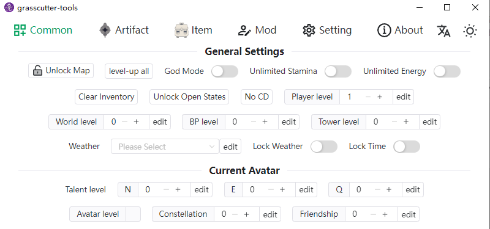
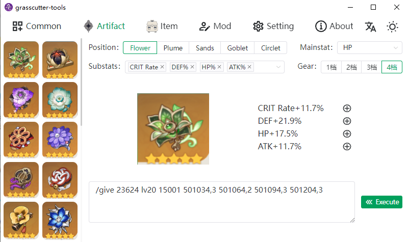
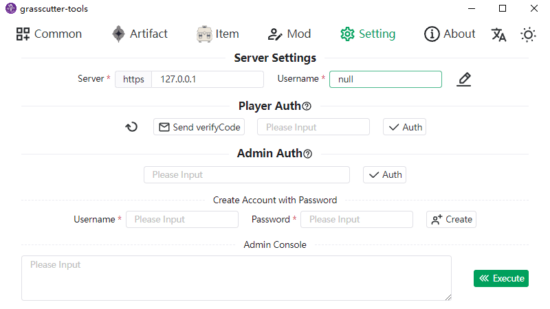

<h1 align="center">Grasscutter Tools</h1>

English | [简体中文](README_zh-CN.md)







[](https://github.com/jianxingxuejian/grasscutter-tools/blob/main/LICENSE)
[](https://github.com/jianxingxuejian/grasscutter-tools/stargazers)
[](https://github.com/jianxingxuejian/grasscutter-tools/releases)
[](https://github.com/jianxingxuejian/grasscutter-tools/releases)

## Features

- [x] Common Command
- [x] Create Artifacts
- [x] Item Category Search
- [x] Manage mods
- [x] Admin Console
- [ ] Automatic Updates
- [ ] Launcher
- [ ] Quest List

## Usage

Need to Server use with the [plugin](https://github.com/jianxingxuejian/grasscutter-plugin/releases/tag/v1.4.0).

Before you use the client, you should complete the easy certification first(send a verification code via in-game mailbox to your game to complete the verification within 1 minute or verify with the password of the game account). If you are the server owner, you can use the Server-Console on it after completing the admin certification.

About mods, please go to the [GIMI](https://github.com/SilentNightSound/GI-Model-Importer) project to understand the basics, how to use the mod function in this project: select the 3DMigoto Loader.exe file and make sure the Mods folder is at the same level. The document structure is as follows:

```
|-- 3DMigoto Loader.exe
|-- Mods
    |-- keqing
        |-- mod1
            |-- KeqingMod
                |-- Keqing.ini
                |-- ...
            |-- modinfo.json
            |-- *.png/jpg/jpeg/jfif
```

You can nest and name as many mods as you want, but be careful that each mod must be in a separate folder, not together with other mods. The program will read all mods and **automatically generate modinfo.json files**, then you can place a picture (at the same level as the mod folder) for the program to read, or you can modify the images field in the modinfo.json file to use network pictures. When you enter the mod page and refresh it, you can see all your mods, you can adjust the aspect ratio of the image, fill in the name and author, and then you can use the keywords to filter. the checkbox on the mod floating window is used to select whether to load the mod or not, when unchecked 3dm will not load the mod.

If you have any questions or want to add features, please open an issue.

## Download

Windows platform download the msi file，mac platform download the dmg file，linux platform download the deb file，Please [go here](https://github.com/jianxingxuejian/grasscutter-tools/releases) to download the latest version.

## Development

Build with Tauri, front-end tech stack: Vue3 + Vite3 + Typescript + Naive-ui + Unocss + Vue I18n.

**Node** and **Rust** environments are required for development, and package manager use **pnpm**.

Install dependencies：

```shell
pnpm install
```

Run：

```shell
pnpm tauri dev
```

Please go to the [Tauri](https://github.com/tauri-apps/tauri) project for more information.

## Contribute

Contributions of any kind are welcome！
